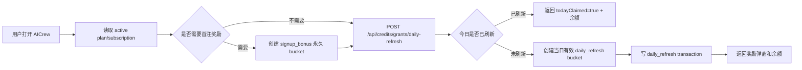
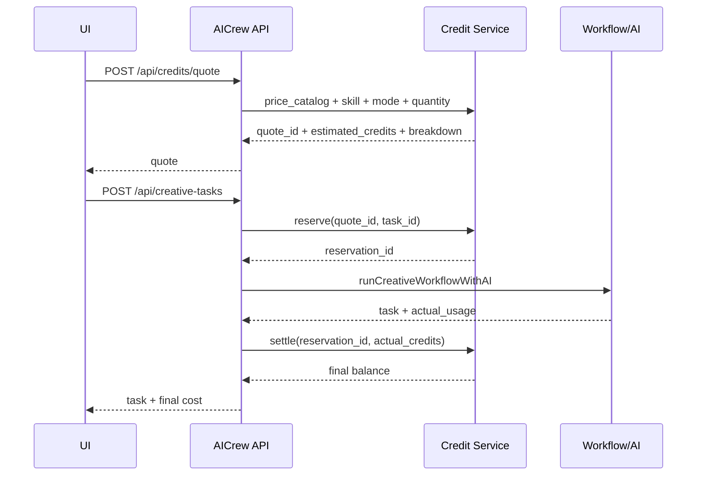
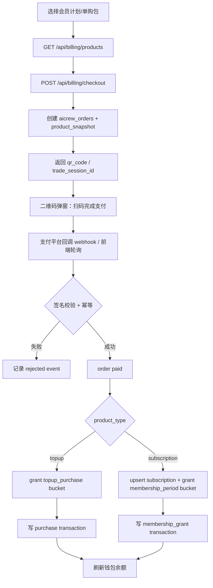
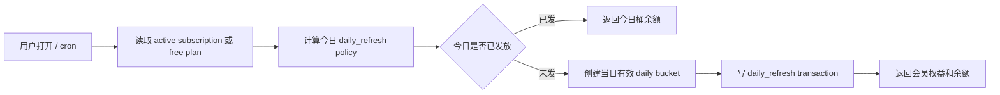
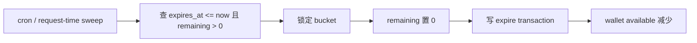

# AICrew 积分系统完整设计

## 1. 目标

为 AICrew 接入一套可运营、可审计、可扩展的积分系统，让“生成前报价、生成中冻结、生成后结算、失败自动退回、权益自动发放、充值/会员可扩展”成为服务端权威能力。

本设计对齐 RoboNeo 的公开积分体系线索，但不直接复制其品牌名或未登录态无法确认的精确价格。AICrew 内部继续使用 `credits`，产品展示可叫“算力积分”；若后续要做 RoboNeo parity，也可以把展示名配置为 `Cyber Carrots`。

## 2. 已验证事实

### 2.1 RoboNeo 公开线索

来源：
- https://www.roboneo.com/
- https://roboneo-public.meitudata.com/public/release/_next/static/chunks/3269-70b0aa72d463232e.js
- https://roboneo-public.meitudata.com/public/release/_next/static/chunks/9992-845acf47301fa93c.js

已观察到的公开能力：

| 维度 | RoboNeo 线索 | 对 AICrew 的设计含义 |
|---|---|---|
| 积分名称 | `Cyber Carrots` | AICrew 需要一个用户可理解的算力货币，可配置展示名 |
| 免费额度 | `Daily login rewards`、`First-time login bonus`、`Log in daily for free credits`、`Valid today only` | 支持首次登录、每日登录、当日有效的短期积分桶 |
| 权益来源 | `Login rewards`、`Membership Gift`、`Top Up Purchase`、`Backend Deduction`、`Auto Expiration` | 流水 type 必须覆盖发放、购买、会员赠送、后台调整、自动过期 |
| 余额页 | `My Cyber Carrots`，有 `Received` / `Used` 两类 tab | AICrew Billing 需要余额总览 + 收入/支出流水 |
| 价格说明 | `RoboNeo Features & Pricing`，字段包括 `category`、`child_category`、`coin_cost_content`、`high_pattern_coin_cost_content`、`unit`、`desc` | 价格必须走服务端价格目录，支持普通/高级模式差异 |
| 功能大类 | Core Features、Image Editing、Image Generation、Video Editing、Video Generation、Branding、Presentations、Web page creation | AICrew 价格目录按任务能力和 Agent 节点定价，而不是只按整任务定价 |
| 支付链路 | 前端出现 product_id、tradeSessionId、getProductTradeProgress、订阅弹窗、二维码支付 | AICrew 需要订单表、支付回调幂等、轮询/刷新余额 |
| 失败提示 | `No Cyber Carrots left...`、`Insufficient Computing Power Radishes`、`Failure Rollback`、`Refund Recovery` | 扣费要有余额不足提示、失败回滚、退款恢复 |

已知数值线索：
- 公开文案出现 `20 Cyber Carrots free / day`。
- 公开文案出现新用户赠送 `{radish_count} Cyber Carrots`。
- 公开文案出现“约可生成 24 张图或 6 个视频”的描述。
- 价格明细 JS 中有 `5 / image`、`1 / image`、`4 / image` 等片段，但完整菜单来自接口，不应硬编码这些值。

### 2.1.1 登录后截图补充确认

用户提供的 RoboNeo 登录态截图补齐了真实会员体系：

| 维度 | 截图事实 | 设计含义 |
|---|---|---|
| 展示货币 | “算力萝卜”，Header 显示胡萝卜图标与余额 | AICrew 可展示为“算力积分”，但内部仍用 `credits` |
| 免费用户余额 | 示例余额分两桶：20 个 2026/06/24 过期，70 个永久有效 | 钱包必须按 bucket 展示有效期，不能只展示一个总数 |
| 每日刷新 | 免费用户显示“每日刷新算力萝卜 20，每日 0 点刷新” | 每日额度是当日桶，到期清零，不是永久充值 |
| 免费版规则 | 首次注册后获得 70；登录后前 7 天 20/天，超过 7 天后 10/天 | 免费计划也要建 plan/policy，不能只建匿名奖励 |
| 普通会员 | 连续包月 68 元/月；每天 20；每月 1300；最多同时处理 5 个任务 | 会员影响积分发放和并发任务上限 |
| 高级会员 | 连续包月 328 元/月；每天 20；每月 6500；最多同时处理 7 个任务 | plan 需要 monthly grant 和 concurrency limit |
| 旗舰会员 | 连续包月 763 元/月；每天 20；每月 16000；同时处理任务数不限 | unlimited 需要显式建模，不能用魔法数字 |
| 单独购买 | 300/680/980(+50)/1680(+170)/3280(+520)/6480(+1520) 算力萝卜包 | 单购包需要 base credits + bonus credits + total grant |
| 支付形态 | 点击订阅后弹二维码，提示扫码完成支付，带支付宝标识和自动续费条款 | checkout 需要 QR 支付、订单轮询、协议版本快照 |
| 入口 | 用户菜单含“开通会员”“算力萝卜使用明细”“兑换码” | Header dropdown 需要会员状态、余额桶、明细、兑换码入口 |

### 2.2 AICrew 当前状态

当前仓库已有积分雏形：

| 位置 | 当前事实 | 差距 |
|---|---|---|
| `README.md` | Product Scope 包含 `Billing and credit ledger`；README 原文是「simulates storage, payments, authentication, and final video rendering」（含 storage） | 已有产品入口，但不是服务端权威账务。注：README「simulated storage」指客户端 localStorage 镜像；服务端 `lib/db/*`（SUPABASE_DB_URL）是**真实持久层**，新钱包表即建于此 |
| `supabase/migrations/20260623120000_create_aicrew_core.sql` | `aicrew_workspaces.credits`、`aicrew_credit_ledger` 已存在 | 只有简易余额和快照流水，无冻结、过期、幂等、订单 |
| `lib/db/repositories/state.js` | 把客户端 `workspace.credits` 和 `creditLedger` replace-all 写入数据库 | 客户端可覆盖账本，不适合真实付费 |
| `lib/domain.js` | `estimateCreditsForSkill`、`task.credits.actual`、`retryAgentStep` 已按 Agent/Skill 估算成本 | 成本模型可复用，但缺服务端 quote/reserve/settle |
| `app/billing/page.tsx` | Billing 路由复用 `AICrewStudio initialView="billing"` | UI 入口存在，但需要接钱包 API |
| `docs/AICrew_Studio_RoboNeo_Product_PRD.md` | 描述 users/workspaces/creative_tasks/agent_runs/MODEL_CALL/credit_transactions。注意 `estimated_credits`/`actual_credits` 落在 **creative_tasks**（非 credit_transactions），credit_transactions 只有 amount/balance_after | PRD 比当前实现更完整，可作为目标架构基础。本设计 §5 已遵循该分层：per-task 估/实落 reservation，per-txn delta 落 ledger |

## 3. 核心原则

1. 服务端权威：余额、冻结、消费、退款、过期都只能由服务端事务写入。
2. 账本不可变：交易流水 append-only；更正通过反向流水，不 update/delete 原交易。
3. 余额可重算：`wallet.available_credits` 是 materialized cache，真实来源是 transactions + buckets。
4. 先冻结后执行：生成任务先 quote，再 reserve；任务成功 settle，失败 refund/release。
5. 价格版本化：每次 quote 固定 `price_catalog_version`，任务执行期间价格变动不影响旧任务。
6. 幂等优先：每日奖励、支付回调、任务扣费、失败退款全部必须有 `idempotency_key`。
7. 积分桶优先级：先消耗即将过期的免费/会员积分，再消耗购买积分。
8. 前端只展示：前端可以预估，但最终扣费以服务端 settlement 为准。
9. 缓存可对账：`available_credits = Σ bucket.remaining_amount`，`reserved_credits = Σ bucket.reserved_amount`，`total = available + reserved = Σ(remaining + reserved) = Σ original − Σ consumed − Σ expired`。每次写事务结束由 `reconcile(walletId)` 校验相等，集成测试强制（守 `invariant_tests`）。

## 4. 产品体系

### 4.1 积分来源

| 来源 | type | 是否付费 | 有效期 | 说明 |
|---|---|---:|---|---|
| 免费版首次注册 | `signup_bonus` | 否 | 永久有效 | 对齐截图 70 算力萝卜；每 user/workspace 一次 |
| 免费版每日刷新 | `daily_refresh_free` | 否 | 当日 23:59:59 | 前 7 天 20/天，超过 7 天后 10/天；每日 0 点刷新 |
| 会员每日刷新 | `daily_refresh_membership` | 是 | 当日 23:59:59 | 付费会员每日 20/天；每日 0 点刷新 |
| 会员月度赠送 | `membership_period_grant` | 是 | 会员周期内或周期后短缓冲 | 普通 1300/月，高级 6500/月，旗舰 16000/月 |
| 单独购买 | `topup_purchase` | 是 | 建议永久有效或 1 年 | 300/680/980/1680/3280/6480 档，支持赠送 bonus |
| 兑换码 | `redeem_code` | 可配置 | 按兑换码策略 | 对齐用户菜单“兑换码”入口 |
| 后台调整 | `admin_adjustment` | 可正可负 | 按原因配置 | 客服补偿、违规扣减 |
| 退款恢复 | `refund` | 否 | 见下「退款路由规则」 | 任务失败回原始未过期桶；支付退款反向冲对应 topup 桶；不得新建永久桶 |

**退款路由规则（确定性，不留二义）**：

- **任务失败退款**：逐条读 `aicrew_credit_reservation_allocations`，把每个来源桶的 `(amount_reserved − amount_settled)` 退回**该原始桶**；若原桶 `expires_at <= now()`（已过期）则该部分积分消失，写 `expire` 而非 `refund`，**绝不退入新建的永久桶**（守 §3.7 + §11「免费积分无限延期」）。
- **支付退款**：是购买的逆操作，反向冲减对应 `topup_purchase` 桶的 `remaining_amount`，并写反向 `refund` 流水。
- **人工恢复**：走 `admin_adjustment`，必须落 `aicrew_credit_audit_logs`（operator + reason），不直接改余额。

### 4.2 积分消耗

| 消耗对象 | 推荐计费维度 | 当前 AICrew 对应 |
|---|---|---|
| LLM 文案/脚本 | prompt complexity + model tier | `credits.llm`、script/copy agent |
| 图片生成 | image count + model tier + mode | `credits.image`、image model |
| 视频生成 | video seconds + resolution + model tier | `credits.video`、video skill |
| 质检/合规 | task or variant count | `credits.qa` |
| 导出打包 | export count + file type | `credits.export` |
| Agent retry | failed step cost or discounted retry cost | `retryAgentStep().cost` |

### 4.3 余额展示

用户可见：
- 当前可用积分。
- 今日免费积分剩余与过期时间。
- 会员本周期积分剩余。
- 购买积分剩余。
- 冻结中积分。
- 收入/支出/过期/退款流水。
- “功能与价格”弹窗：按大类展示每类任务消耗。

### 4.4 会员与商品标准

RoboNeo 截图给出的标准应拆为两类目录：会员计划 `membership_plans` 和单购商品 `credit_products`。AICrew 不在 UI 硬编码数值，所有展示从服务端目录返回。

会员计划：

| plan | 展示名 | 价格 | 首注 | 每日刷新 | 月度赠送 | 并发任务 | 其它权益 |
|---|---|---:|---:|---:|---:|---:|---|
| `free` | 免费版 | 0/月 | 70 | 前 7 天 20/天；之后 10/天 | 0 | 当前默认限制 | 当前套餐 |
| `standard_monthly` | 普通会员-连续包月 | 68/月 | 0 | 20/天 | 1300/月 | 5 | 新功能试用 |
| `pro_monthly` | 高级会员-连续包月 | 328/月 | 0 | 20/天 | 6500/月 | 7 | 新功能试用 |
| `flagship_monthly` | 旗舰会员-连续包月 | 763/月 | 0 | 20/天 | 16000/月 | unlimited | 新功能试用 |

单购商品：

| product | 展示积分 | 赠送 | 价格 | 建模建议 |
|---|---:|---:|---:|---|
| `topup_300` | 300 | 0 | 30 | base=300, bonus=0 |
| `topup_680` | 680 | 0 | 68 | base=680, bonus=0 |
| `topup_980` | 980 | 50 | 98 | base=980, bonus=50 |
| `topup_1680` | 1680 | 170 | 168 | base=1680, bonus=170 |
| `topup_3280` | 3280 | 520 | 328 | base=3280, bonus=520 |
| `topup_6480` | 6480 | 1520 | 648 | base=6480, bonus=1520 |

说明：截图 badge 使用 `+50/+170/+520/+1520`，本设计按“额外赠送”建模，订单发放 `base_credits + bonus_credits`。如果后端真实 product amount 已包含赠送，只需要把 `total_credits` 改为后端值，账务表不需要改。

会员权益拆分：
- 首注 70：`signup_bonus` 桶，永久有效。
- 每日刷新：`daily_refresh_*` 桶，当日有效，每日 0 点重新发放/刷新。
- 月度赠送：`membership_period_grant` 桶，绑定 subscription period。
- 并发任务：不属于积分，但属于 plan entitlement，应在任务创建前检查。
- 新功能试用：feature flag 权益，走 plan entitlement，不写入积分账本。

## 5. 目标数据模型

保留现有 `aicrew_workspaces.credits` 作为展示缓存，但真实账务新增以下表。

```sql
create table public.aicrew_wallets (
  id uuid primary key default gen_random_uuid(),
  workspace_id text not null references public.aicrew_workspaces(id) on delete cascade,
  user_id text,
  currency text not null default 'credits',
  display_name text not null default '算力积分',
  available_credits integer not null default 0 check (available_credits >= 0),
  reserved_credits integer not null default 0 check (reserved_credits >= 0),
  lifetime_granted integer not null default 0,
  lifetime_purchased integer not null default 0,
  lifetime_consumed integer not null default 0,
  version integer not null default 0,
  created_at timestamptz not null default now(),
  updated_at timestamptz not null default now(),
  unique (workspace_id, currency)
);
```

```sql
create table public.aicrew_credit_buckets (
  id uuid primary key default gen_random_uuid(),
  wallet_id uuid not null references public.aicrew_wallets(id) on delete cascade,
  source_type text not null,
  original_amount integer not null check (original_amount >= 0),
  remaining_amount integer not null check (remaining_amount >= 0),
  reserved_amount integer not null default 0 check (reserved_amount >= 0),
  expires_at timestamptz,
  priority integer not null default 100,
  grant_policy_id text,                -- FK -> aicrew_credit_policies(id)（建表顺序原因用 ALTER 后加）
  order_id uuid,                       -- FK -> aicrew_orders(id)（建表顺序原因用 ALTER 后加）
  metadata jsonb not null default '{}'::jsonb,
  created_at timestamptz not null default now(),
  check (remaining_amount + reserved_amount <= original_amount)
);

create index aicrew_credit_buckets_spend_idx
on public.aicrew_credit_buckets(wallet_id, priority, expires_at nulls last, created_at);
```

```sql
create table public.aicrew_credit_transactions (
  id uuid primary key default gen_random_uuid(),
  wallet_id uuid not null references public.aicrew_wallets(id) on delete cascade,
  bucket_id uuid references public.aicrew_credit_buckets(id),  -- 单桶变动直接用；跨桶留空，逐桶见 allocations 子表
  type text not null,                  -- grant|reserve|settle|release|refund|expire|admin_adjustment|topup_purchase|membership_grant
  status text not null default 'posted',  -- posted | pending(hold) | superseded；只有 posted 计入 spent/received 汇总
  amount integer not null,             -- 有符号：扣费/过期为负，发放/退款为正
  balance_after integer not null,      -- 定义为该笔后 wallet 总额 = available_after + reserved_after（非仅 available）
  reserved_after integer not null default 0,
  price_catalog_version text,          -- reserve/settle 固定的价格目录版本，守 §3.5 价格版本化
  reference_type text,
  reference_id text,
  idempotency_key text not null,
  description text not null default '',
  metadata jsonb not null default '{}'::jsonb,
  created_by text,
  created_at timestamptz not null default now(),
  unique (wallet_id, idempotency_key)
);
```

```sql
create table public.aicrew_credit_reservations (
  id uuid primary key default gen_random_uuid(),
  wallet_id uuid not null references public.aicrew_wallets(id) on delete cascade,
  task_id text not null,
  quote_id uuid not null,
  amount_reserved integer not null check (amount_reserved >= 0),
  amount_settled integer not null default 0 check (amount_settled >= 0),
  price_catalog_version text not null,     -- 冻结报价时的目录版本，settle 据此结算，守 §3.5
  status text not null default 'reserved', -- 状态机：reserved -> settled | released | expired（终态，CAS 守幂等）
  idempotency_key text not null,
  -- 30min 适用于短任务；视频等长任务由 quote 按预估时长设置更长 expires_at（见 §6.5 reaper）
  expires_at timestamptz not null default (now() + interval '30 minutes'),
  metadata jsonb not null default '{}'::jsonb,
  created_at timestamptz not null default now(),
  updated_at timestamptz not null default now(),
  unique (wallet_id, idempotency_key)
);
```

```sql
-- per-reservation 桶分配：多桶扣费把每个来源桶的冻结额落库，
-- settle/release/refund 据此精确回到原始桶（守 §3.9 对账 + 退款路由规则）
create table public.aicrew_credit_reservation_allocations (
  id uuid primary key default gen_random_uuid(),
  reservation_id uuid not null references public.aicrew_credit_reservations(id) on delete cascade,
  bucket_id uuid not null references public.aicrew_credit_buckets(id),
  amount_reserved integer not null check (amount_reserved >= 0),
  amount_settled integer not null default 0 check (amount_settled >= 0),
  source_expires_at timestamptz,       -- 冻结时快照来源桶有效期，退款据此判断是否复活
  created_at timestamptz not null default now(),
  unique (reservation_id, bucket_id)
);

-- per-transaction 桶分配：一笔 reserve/settle/refund 跨多桶时，
-- 用子表表达逐桶变动，父行 bucket_id 留空（守 §3.3 可重算）
create table public.aicrew_credit_transaction_allocations (
  id uuid primary key default gen_random_uuid(),
  transaction_id uuid not null references public.aicrew_credit_transactions(id) on delete cascade,
  bucket_id uuid not null references public.aicrew_credit_buckets(id),
  amount integer not null,             -- 有符号：扣费为负，退款/发放为正
  created_at timestamptz not null default now()
);
```

```sql
-- 兑换码：只存 hash 防库泄露直接可用；按码 + 钱包唯一防重复领取；按次数风控防枚举
create table public.aicrew_redeem_codes (
  id uuid primary key default gen_random_uuid(),
  code_hash text not null unique,
  policy_id text,                      -- FK -> aicrew_credit_policies(id)（policies 在后文建表，用 ALTER 后加，避免单迁移前向引用失败）
  credits integer not null check (credits >= 0),
  max_redemptions integer not null default 1,
  redeemed_count integer not null default 0,
  expires_at timestamptz,
  status text not null default 'active',  -- active | exhausted | disabled | expired
  created_at timestamptz not null default now()
);

create table public.aicrew_redeem_records (
  id uuid primary key default gen_random_uuid(),
  code_id uuid not null references public.aicrew_redeem_codes(id),
  wallet_id uuid not null references public.aicrew_wallets(id),
  idempotency_key text not null,
  created_at timestamptz not null default now(),
  unique (code_id, wallet_id),         -- 每钱包每码一次
  unique (wallet_id, idempotency_key)
);
```

```sql
-- 审计日志：admin 调账 / 手动发放 / 价格发布 / 退款等敏感操作强制留痕，
-- operator + role + reason 不可空，是 §11 admin 授权与异常追责的依据
create table public.aicrew_credit_audit_logs (
  id uuid primary key default gen_random_uuid(),
  wallet_id uuid references public.aicrew_wallets(id),
  action text not null,                -- admin_adjust | manual_grant | refund | price_publish | ...
  operator_id text not null,
  operator_role text not null,
  reason text not null,
  before_snapshot jsonb not null default '{}'::jsonb,
  after_snapshot jsonb not null default '{}'::jsonb,
  metadata jsonb not null default '{}'::jsonb,
  created_at timestamptz not null default now()
);
```

```sql
create table public.aicrew_price_catalogs (
  id uuid primary key default gen_random_uuid(),
  version text not null unique,
  status text not null default 'draft',
  effective_at timestamptz not null,
  created_at timestamptz not null default now()
);

create table public.aicrew_price_rules (
  id uuid primary key default gen_random_uuid(),
  catalog_id uuid not null references public.aicrew_price_catalogs(id) on delete cascade,
  category text not null,
  task_type text not null,
  mode text not null default 'normal',
  unit text not null,
  unit_cost integer not null,
  min_cost integer not null default 0,
  formula jsonb not null default '{}'::jsonb,
  examples jsonb not null default '[]'::jsonb,
  unique (catalog_id, category, task_type, mode)
);
```

```sql
create table public.aicrew_credit_policies (
  id text primary key,
  type text not null,
  amount integer not null,
  max_per_user integer,
  max_per_day integer,
  expires_in interval,
  enabled boolean not null default true,
  metadata jsonb not null default '{}'::jsonb
);
```

```sql
create table public.aicrew_membership_plans (
  id text primary key,
  display_name text not null,
  tier integer not null default 0,
  billing_cycle text not null default 'monthly',
  price_amount numeric(12,2) not null default 0,
  currency text not null default 'CNY',
  recurring boolean not null default true,
  signup_bonus_credits integer not null default 0,
  free_daily_first_days integer not null default 0,
  free_daily_first_amount integer not null default 0,
  daily_refresh_credits integer not null default 0,
  monthly_grant_credits integer not null default 0,
  concurrent_task_limit integer,           -- NULL = 不限（旗舰）；判定见 §11 并发行，禁止 active < NULL 误拦
  feature_trial_enabled boolean not null default false,
  status text not null default 'active',
  metadata jsonb not null default '{}'::jsonb,
  created_at timestamptz not null default now(),
  updated_at timestamptz not null default now()
);

create table public.aicrew_credit_products (
  id text primary key,
  product_type text not null,
  display_name text not null,
  price_amount numeric(12,2) not null,
  currency text not null default 'CNY',
  base_credits integer not null default 0,
  bonus_credits integer not null default 0,
  total_credits integer generated always as (base_credits + bonus_credits) stored,
  plan_id text references public.aicrew_membership_plans(id),
  provider_product_id text,
  display_order integer not null default 100,
  status text not null default 'active',
  metadata jsonb not null default '{}'::jsonb,
  created_at timestamptz not null default now(),
  updated_at timestamptz not null default now()
);
```

```sql
create table public.aicrew_orders (
  id uuid primary key default gen_random_uuid(),
  workspace_id text not null references public.aicrew_workspaces(id) on delete cascade,
  wallet_id uuid not null references public.aicrew_wallets(id),
  provider text not null,
  provider_order_id text,
  product_id text not null references public.aicrew_credit_products(id),
  product_name text not null,
  product_snapshot jsonb not null default '{}'::jsonb,
  amount_money numeric(12,2) not null,
  currency text not null default 'CNY',
  credits integer not null,
  bonus_credits integer not null default 0,
  status text not null default 'created',
  idempotency_key text not null,
  metadata jsonb not null default '{}'::jsonb,
  created_at timestamptz not null default now(),
  paid_at timestamptz,
  unique (provider, provider_order_id),
  unique (wallet_id, idempotency_key)
);
```

```sql
create table public.aicrew_subscriptions (
  id uuid primary key default gen_random_uuid(),
  workspace_id text not null references public.aicrew_workspaces(id) on delete cascade,
  wallet_id uuid not null references public.aicrew_wallets(id),
  provider text not null,
  provider_subscription_id text,
  plan_id text not null references public.aicrew_membership_plans(id),
  plan_snapshot jsonb not null default '{}'::jsonb,
  status text not null,
  auto_renew boolean not null default true,
  cancel_at_period_end boolean not null default false,
  period_start timestamptz,
  period_end timestamptz,
  daily_refresh_credits integer not null default 0,
  monthly_grant_credits integer not null default 0,
  concurrent_task_limit integer,           -- NULL = 不限（旗舰）；判定见 §11 并发行，禁止 active < NULL 误拦
  metadata jsonb not null default '{}'::jsonb,
  created_at timestamptz not null default now(),
  updated_at timestamptz not null default now()
);
```

## 6. 核心流程

### 6.1 首次奖励与每日刷新



约束：
- `idempotency_key = signup_bonus:{wallet_id}`。
- `idempotency_key = daily_refresh:{wallet_id}:{yyyy-mm-dd@tz}:{plan_id}`，其中 `yyyy-mm-dd@tz` 按**用户时区**当日日期生成（非 UTC 裸日期），避免跨 UTC/用户时区边界重复领或漏领。
- 注意：键以 `wallet_id` 为锚。auth 落地前所有人共享 default 钱包 → 全站每天只有一次领取额，这是单 default 钱包的已知后果（见 frontmatter invariants 与 §15），不靠改键修复，靠 per-user 钱包隔离修复。
- 免费版第 1-7 天每日 20；第 8 天起每日 10；付费会员每日 20。
- daily refresh 积分 `expires_at = user timezone 当日结束`。
- 支持风控：同设备、同 IP、异常注册密度可以不给奖励或延迟奖励。

### 6.2 生成任务扣费



失败分支（全部经 `reservation.status` 状态机 + 各自 `idempotency_key` 守幂等，伪代码见 §9）：
- **AI 未开始**：`release(reservation)` —— 逐 allocation 把 `amount_reserved` 整额 reserved→remaining 退回原桶，wallet reserved→available，status `reserved → released`。key=`release:{reservation_id}`。
- **AI 部分完成但无可交付**：等价 release full（`settled = 0`）。
- **AI 部分完成且有可交付**：`settle(reservation, actual)`，`settled = min(actual, amount_reserved)`，`remainder = amount_reserved − settled`；settled 部分 reserved→consumed，remainder 按「退款路由规则」回原桶（原桶已过期则消失），status `reserved → settled`。key=`settle:{reservation_id}`。
- **迟到调用**：settle/release 必须断言 `status='reserved'` 并 CAS；对已 `settled/released/expired` 的 reservation 直接返回既有结果，**不二次扣费、不二次退款**。
- **Provider 重复回调**：同 `idempotency_key` 命中 unique 约束，返回已处理结果。

### 6.3 单购充值与会员订阅



约束：
- 订单保存 `product_snapshot`，价格或权益改版不影响历史订单解释。
- QR 支付弹窗保存 `agreement_version` 和 `auto_renew_terms_accepted_at`。
- 单购包写 `topup_purchase` 桶，会员包写 `membership_period_grant` 桶。
- 会员每日 20 不在支付成功时一次性发放，按每日刷新策略发放。

首期可先做“后台手动开通会员/充值 + 订单表占位”，真实支付接入放第二阶段。

### 6.4 会员周期权益刷新



免费版规则：注册当天发放 70 永久桶；注册后 7 天内每日 20，当日有效；第 8 天起每日 10，当日有效。

付费版规则：普通/高级/旗舰每月分别发放 1300/6500/16000 周期桶；每日额外刷新 20 当日桶；并发任务上限由 plan entitlement 控制。

### 6.5 自动过期



推荐：
- 每次 wallet API 调用先做轻量过期 sweep；**sweep 必须在持有 wallet `for update` 锁的同一事务内改 bucket/wallet**，不能与 reserve 并发裸写（否则 reserve 可能分配到正在过期的桶）。
- `reserveCredits` 在可用额检查**之前**先在本事务内跑一次 sweep，或让 `allocateBuckets` 过滤 `expires_at > now()` 并据活桶重算可用额（守 §3.9 对账）。
- 每日 cron 做全量补偿。
- 过期只影响 `remaining_amount`，历史流水不删除。
- **stale reservation reaper**：cron 扫 `status='reserved' and expires_at <= now()` 的 reservation，按 `release` 语义归还冻结额并置 `status='expired'`；视频等长任务必须在 reserve 时按预估时长设置足够长的 `expires_at`，避免任务未完就被 reaper 释放（与迟到 settle 的 CAS 协同：被 reaper 释放后 settle 命中非 `reserved` 状态即幂等返回，不再扣费）。

## 7. API 设计

### 7.1 钱包与流水

```http
GET /api/credits/wallet
```

返回：

```json
{
  "currency": "credits",
  "display_name": "算力积分",
  "available_credits": 3820,
  "reserved_credits": 120,
  "membership": {
    "plan_id": "standard_monthly",
    "display_name": "普通会员-连续包月",
    "period_end": "2026-07-24T15:59:59Z",
    "concurrent_task_limit": 5
  },
  "daily_refresh": {
    "amount": 20,
    "claimed_today": true,
    "expires_at": "2026-06-24T15:59:59Z"
  },
  "buckets": [
    { "source_type": "daily_refresh_membership", "remaining": 12, "expires_at": "2026-06-24T15:59:59Z" },
    { "source_type": "membership_period_grant", "remaining": 1300, "expires_at": "2026-07-24T15:59:59Z" },
    { "source_type": "topup_purchase", "remaining": 1200, "expires_at": null }
  ]
}
```

```http
GET /api/credits/ledger?type=received|spent&cursor=...
```

### 7.2 价格目录

```http
GET /api/credits/pricing
```

返回类似 RoboNeo `Features & Pricing`：

```json
{
  "version": "2026-06-24-v1",
  "menu_items": [
    {
      "category": "Image Generation",
      "category_list": [
        {
          "child_category": "Text to Image",
          "coin_cost_content": "5",
          "high_pattern_coin_cost_content": "12",
          "unit": "/ image",
          "desc": "Generate images from a prompt"
        }
      ]
    }
  ]
}
```

### 7.3 报价、冻结、结算

```http
POST /api/credits/quote
```

```json
{
  "skill_id": "ecom_tiktok_product_ad_v1",
  "mode": "normal",
  "quantity": 3,
  "enabled_modes": { "text": true, "image": true, "video": false },
  "brief_complexity": { "selling_points_count": 4, "asset_count": 2 }
}
```

```http
POST /api/credits/reservations
POST /api/credits/reservations/{reservation_id}/settle
POST /api/credits/reservations/{reservation_id}/release
```

### 7.4 奖励、订单、会员

```http
POST /api/credits/grants/daily-refresh
GET  /api/billing/membership-plans
GET  /api/billing/products
POST /api/billing/checkout
POST /api/billing/webhook/:provider
GET  /api/billing/orders
GET  /api/billing/subscription
POST /api/billing/subscription/cancel
POST /api/billing/redeem-code
POST /api/admin/credits/adjust
```

## 8. 当前代码接入点

| 层 | 当前入口 | 接入方式 |
|---|---|---|
| DB | `lib/db/client.js`、`withDbRetry` | 新增 `lib/db/repositories/credits.js`，所有钱包事务走 SQL transaction |
| State API | `app/api/state/route.ts` | 移除客户端对 `workspace.credits` / `creditLedger` 的权威写入；只可同步展示快照 |
| Domain 估算 | `estimateCreditsForSkill` | 迁到服务端 quote service 或作为 fallback；最终使用 price catalog |
| Workflow | `runCreativeWorkflowWithAI` | 不直接扣费；由 `POST /api/creative-tasks` 包裹 reserve/settle |
| Retry | `retryAgentStep` | retry 前 quote/reserve，成功后 settle |
| UI | `AICrewStudio` billing/workbench/header | header balance chip、billing ledger、run button 余额不足态、pricing modal |
| Admin | `app/admin/page.tsx` | 价格目录、人工调账、异常交易查询 |

兼容策略：
- `workspace.credits` 初期作为 `aicrew_wallets.available_credits` 的只读镜像。
- `aicrew_credit_ledger` 可迁移为 `aicrew_credit_transactions` 的展示视图；新写入改走新表。
- 现有 demo state 不删除，标记为 `source_type = demo_seed`，避免误计入真实收入。

## 9. 扣费事务伪代码

**约定（守 §3.9 对账等式）**：

- `reserve` 是 **hold**（持有），不是消费：把额度在桶内从 `remaining_amount` 移到 `reserved_amount`，钱包从 `available_credits` 移到 `reserved_credits`；**总额不变**。
- `settle` 才是 **capture**（捕获）：把实际消耗从 `reserved_amount` 变 consumed（离开账户），未用部分按「退款路由规则」回原桶。
- 流水 `balance_after = available_after + reserved_after`（总额）。`reserve` 行 `status='pending'`，**不计入 spent/received 汇总**；`settle/refund/expire/grant` 行 `status='posted'` 才计入。
- 幂等键：`reserve:{idempotencyKey}` / `settle:{reservation_id}` / `release:{reservation_id}`。settle/release 必须在 wallet 锁内对 `reservation.status` 做 CAS，终态后再调用直接幂等返回。
- 单 `pool max=1` 连接当前会串行化写；`lockWallet` 用 `select ... for update`（悲观锁），`wallet.version` 仅在未来放开连接池时启用乐观 CAS，二选一，不混用。

```ts
// RESERVE：先 sweep 过期、再锁钱包、按软冲突幂等、逐桶冻结、落 allocation
async function reserveCredits({ walletId, quoteId, taskId, amount, priceCatalogVersion, idempotencyKey }) {
  return sql.begin(async tx => {
    const wallet = await lockWallet(tx, walletId);            // for update：所有写的串行点
    await sweepExpiredBuckets(tx, walletId);                  // §6.5：锁内过期，避免分配到将过期桶
    const live = await reloadWallet(tx, walletId);
    if (live.available_credits < amount) {
      throw new Error(`INSUFFICIENT_CREDITS: need ${amount}, available ${live.available_credits}`);
    }

    // soonest-expire-first / priority（aicrew_credit_buckets_spend_idx），仅取 expires_at > now() 的活桶
    const allocations = await allocateBuckets(tx, walletId, amount); // [{ bucketId, amount, sourceExpiresAt }]

    // 幂等：reservation 唯一键兜底。on conflict do nothing，命中既有则直接返回（软冲突不再重复扣）
    const reservation = await insertReservationOnConflict(tx, {
      walletId, quoteId, taskId, amountReserved: amount, priceCatalogVersion,
      status: "reserved", idempotencyKey,
    });
    if (reservation.alreadyExisted) return reservation;

    for (const a of allocations) {
      await moveBucket(tx, a.bucketId, { remaining: -a.amount, reserved: +a.amount }); // remaining→reserved
      await insertReservationAllocation(tx, {
        reservationId: reservation.id, bucketId: a.bucketId,
        amountReserved: a.amount, sourceExpiresAt: a.sourceExpiresAt,
      });
    }
    await updateWallet(tx, walletId, {
      available_credits: live.available_credits - amount,     // available→reserved，总额不变
      reserved_credits: live.reserved_credits + amount,
    });
    const txn = await appendTransaction(tx, {
      walletId, type: "reserve", status: "pending", amount: -amount,
      balance_after: live.available_credits + live.reserved_credits, // 总额不变
      reserved_after: live.reserved_credits + amount,
      reference_type: "task", reference_id: taskId, price_catalog_version: priceCatalogVersion,
      idempotency_key: `reserve:${idempotencyKey}`,
    });
    for (const a of allocations) await insertTxnAllocation(tx, { transactionId: txn.id, bucketId: a.bucketId, amount: -a.amount });
    return reservation;
  });
}

// SETTLE/RELEASE：捕获实际消耗，未用部分回原桶（过期则消失），状态机 CAS 守迟到/重复
// actual>0 → kind='settle'（含 partial）；actual===0 → kind='release'（AI 未开始/无可交付）
async function settleCredits({ reservationId, actual }) {
  return sql.begin(async tx => {
    const r = await lockReservation(tx, reservationId);
    // 迟到/重复：已 settled/released/expired → 幂等返回既有 capture 流水，与成功路径同形（{reservation,transaction}）
    if (r.status !== "reserved") return { reservation: r, transaction: await findCaptureTxn(tx, reservationId) };
    const wallet = await lockWallet(tx, r.wallet_id);
    const settled = Math.min(actual, r.amount_reserved);     // 断言 actual ≤ reserved，截断保护
    const kind = settled === 0 ? "release" : "settle";       // release 与 settle 独立 type/status/key
    // 消费顺序必须与 reserve 的 soonest-expire-first 对齐：listReservationAllocations 按 source_expires_at nulls last, bucket_id 排序
    const allocs = await listReservationAllocations(tx, reservationId); // 已按 source_expires_at 升序

    let remainderTotal = 0, expiredLostTotal = 0, consumedRemaining = settled;
    for (const a of allocs) {
      const consume = Math.min(consumedRemaining, a.amount_reserved); // 本桶被实际消耗的额（先扣将过期桶）
      consumedRemaining -= consume;
      const back = a.amount_reserved - consume;              // 本桶冻结里未用的额
      await moveBucket(tx, a.bucketId, { reserved: -a.amount_reserved }); // 整桶冻结额先全部退出 reserved
      if (back > 0) {
        const expired = a.source_expires_at && a.source_expires_at <= now();
        if (expired) {
          expiredLostTotal += back;                          // 原桶已过期 → 未用部分消失（实测累加，不靠减法推导）
        } else {
          await moveBucket(tx, a.bucketId, { remaining: +back }); // 回原桶，守原 expires_at
          remainderTotal += back;                            // 仅未过期未用部分回 available
        }
      }
      await bumpReservationAllocationSettled(tx, a.bucketId, reservationId, consume);
    }
    // assert consumedRemaining === 0（Σconsume == settled）；reserve 时已 assert Σamount_reserved == amount_reserved
    const reservedAfter = wallet.reserved_credits - r.amount_reserved;     // 解冻全部冻结
    const availableAfter = wallet.available_credits + remainderTotal;      // 仅未过期未用部分回 available
    await updateWallet(tx, r.wallet_id, {
      reserved_credits: reservedAfter,
      available_credits: availableAfter,
      lifetime_consumed: wallet.lifetime_consumed + settled,
    });
    await supersedeReserveTxn(tx, reservationId);            // 把 pending 的 reserve 行置 superseded
    const balanceAfter = availableAfter + reservedAfter;
    const captureTxn = await appendTransaction(tx, {
      walletId: r.wallet_id, type: kind, status: "posted", amount: -settled,
      balance_after: balanceAfter, reserved_after: reservedAfter,
      reference_type: "task", reference_id: r.task_id, price_catalog_version: r.price_catalog_version,
      idempotency_key: `${kind}:${reservationId}`,           // settle:{id} 或 release:{id}，命名空间独立
    });
    if (expiredLostTotal > 0) await appendTransaction(tx, {  // expire 掉「未用且原桶已过期」的部分，账面可对
      walletId: r.wallet_id, type: "expire", status: "posted", amount: -expiredLostTotal,
      balance_after: balanceAfter, reserved_after: reservedAfter,
      reference_type: "reservation", reference_id: reservationId,
      idempotency_key: `${kind}_expire:${reservationId}`,
    });
    await updateReservation(tx, reservationId, {
      status: kind === "release" ? "released" : "settled", amount_settled: settled,
    });
    return { reservation: await reloadReservation(tx, reservationId), transaction: captureTxn };
  });
}

// RELEASE：未消耗即整额归还 = settle(actual=0)，自动判定 kind='release' → key=release:{id}、type='release'、status='released'
async function releaseCredits({ reservationId }) {
  return settleCredits({ reservationId, actual: 0 });
}

// EXPIRE：单桶过期清零，append-only
async function expireBucket({ bucketId }) {
  return sql.begin(async tx => {
    const b = await lockBucketAndWallet(tx, bucketId);
    if (b.remaining_amount <= 0) return;                     // 幂等
    await moveBucket(tx, bucketId, { remaining: -b.remaining_amount });
    const availableAfter = b.wallet.available_credits - b.remaining_amount;
    await updateWallet(tx, b.wallet_id, { available_credits: availableAfter });
    await appendTransaction(tx, {
      walletId: b.wallet_id, type: "expire", status: "posted", amount: -b.remaining_amount,
      balance_after: availableAfter + b.wallet.reserved_credits, reserved_after: b.wallet.reserved_credits,
      bucket_id: bucketId, reference_type: "bucket", reference_id: bucketId,
      idempotency_key: `expire:${bucketId}:${dayKey()}`,
    });
  });
}
```

> 支付退款（订单维度）是购买的逆操作，反向冲减对应 `topup_purchase` 桶并写 `refund` 流水，走 §6.3 webhook 幂等，不复用上面任务维度的 `settle/release`。

## 10. UI 设计

### 10.1 Header

- 显示余额 chip：`3820 credits`。
- 点击头像/余额打开下拉：会员状态、开通会员按钮、算力桶明细、每日刷新额度、明细入口、兑换码入口。
- hover 展示：可用、冻结、今日到期。
- 余额不足时 chip 变为 warning，点击进充值页。

### 10.2 Workbench

- 运行前展示报价：`预计消耗 120 credits`。
- 切换模式/数量/模型后重新 quote。
- 运行按钮：
  - 余额充足：`生成`
  - 余额不足：`积分不足 · 去充值`
  - 有免费奖励可领：`领取今日积分后生成`
- 运行完成展示：`实际消耗 112 credits，已退回 8 credits`。

### 10.3 Billing

Tabs：
- `Overview`：余额、当前会员、每日刷新、月度赠送、单购包。
- `Membership`：免费版、普通会员、高级会员、旗舰会员；展示价格、月赠、每日刷新、并发任务。
- `Top up`：300/680/980/1680/3280/6480 单购包，展示赠送 badge。
- `Received`：购买、会员赠送、每日刷新、兑换码、后台补偿。
- `Used`：任务扣费、重试扣费、过期、后台扣减。
- `Pricing`：功能与价格。

### 10.4 Admin

- 钱包查询：workspace/user、余额、冻结、桶明细。
- 手动调账：必须写 reason，不允许直接改余额。
- 价格目录：draft → preview → publish。
- 异常交易：负余额、长时间 reserved、重复 webhook、失败未退款。

## 11. 风控与审计

| 风险 | 防护 |
|---|---|
| 客户端篡改余额 | state API 不接受 `workspace.credits` 作为权威输入；迁移把旧 `aicrew_workspaces.credits` 降为只读镜像，PUT /api/state 不再写账本 |
| 并发双扣/超扣 | wallet row `for update` + reservation idempotency + CHECK(available/reserved >= 0) DB 兜底 |
| settle/release 重复或迟到 | `reservation.status` CAS（reserved→终态）+ `settle:`/`release:{reservation_id}` 键；迟到命中非 reserved 即幂等返回，不二次扣 |
| 过期 sweep 与 reserve 竞态 | sweep 与 allocate 同在 wallet `for update` 事务内；allocate 仅取 `expires_at > now()` 活桶 |
| 多桶退款错桶/漏账 | `reservation_allocations` 持久化 per-bucket 来源 + `source_expires_at`；退款只回原桶，原桶已过期则消失 |
| 支付重复回调 | provider + provider_order_id unique |
| webhook 伪造/重放 | 签名校验 + 时间戳重放窗口 + 金额×`product_snapshot` 对账 + provider_order_id unique |
| 每日奖励刷取 | wallet/date unique + device/IP 风控；单 default 钱包下全员共享当日额（见跨租户隔离行） |
| 兑换码枚举/爆破 | 只存 `code_hash` + 按 IP/账号限流 + `max_redemptions` + 每钱包每码 unique |
| 任务失败未退款 | workflow finally 中 release/settle；stale reservation reaper 按 release 归还并置 expired |
| 价格变更争议 | quote 固定 catalog version，并落 `price_catalog_version` 到 reservation/transaction |
| 免费积分无限延期 | bucket expires_at + sweep + expire transaction |
| 会员权益错发 | subscription period + daily idempotency + plan_snapshot |
| 并发任务绕过会员限制 | task creation 事务内统计 active(in-progress) reservation/task 数；判定 `limit != null && active >= limit → 拒`（`concurrent_task_limit` 为 NULL 表示旗舰**不限**，跳过检查，避免 `active < NULL` 误拦全部） |
| 自动续费争议 | 保存 agreement_version、terms_accepted_at、cancel_at_period_end |
| admin 越权/打负余额 | 操作前 role 鉴权 + CHECK(>=0) 拦负 + `aicrew_credit_audit_logs` 强制 operator+role+reason 留痕 |
| 跨租户隔离缺失 | 单 default 钱包下全员共享余额；真钱表(orders/subscriptions/topup_purchase 桶)必须 auth + per-user 钱包落地后才上线 |

## 12. 测试策略

风险等级：L3。原因：涉及余额、并发、失败回滚、未来支付。

必须测试：

| 测试层 | 用例 |
|---|---|
| Unit | price quote、bucket allocation、soonest-expire-first、idempotency key、partial settle 数学(`settled=min(actual,reserved)`)、退款回原桶/过期消失 |
| Integration | reserve/settle/release/refund、并发扣费不负余额、daily refresh 重复领取、**reconcile() 等式校验(每次写后 available=Σremaining、reserved=Σreserved)**、多桶扣费逐桶归因、partial settle remainder 路由、settle/release 迟到+重复幂等、reserve 与 sweep 边界竞态、settle 消费顺序=soonest-expire-first(与 reserve 对齐，验逆序不浪费将过期桶) |
| DB | migration idempotent、unique constraints、transaction rollback、generated total_credits、CHECK(>=0) 拒负、`remaining+reserved<=original`、reservation_allocations 持久化、`balance_after == available_after+reserved_after` |
| API | insufficient credits、stale reservation sweep、pricing version、membership plan entitlement |
| Billing | product snapshot、QR checkout、subscription activation、cancel_at_period_end |
| UI smoke | workbench 报价、余额不足态、billing ledger tabs |
| Security review | client state 不可覆盖 server wallet、webhook 签名校验 |

建议新增测试文件：
- `tests/credits.test.js`
- `tests/credits.integration.test.js`
- `tests/billing-api.test.js`

## 13. 分阶段落地

### Phase 0：设计冻结

产物：本文档。

验收：
- 已明确产品规则、账务模型、API、迁移路径、测试策略。

### Phase 1：服务端钱包只读化

任务：
- 新增 wallet/transaction/bucket 表。
- 迁移：把现有 `aicrew_workspaces.credits` 映射成**单个** `source_type=demo_seed` bucket，并令 `available_credits = Σ bucket.remaining_amount`；旧 `aicrew_credit_ledger` 行标记为展示-only，**不再二次求和进余额**（避免标量 credits 与 Σbucket 双计，守 §3.9）。
- **将 State API 去权威化纳入本 Phase**：移除 `lib/db/repositories/state.js` 对 `workspace.credits` / `creditLedger` 的写入，否则「前端不再把 workspace.credits 当权威余额」无法在 Phase 1 内真正达成。
- `GET /api/credits/wallet`、`GET /api/credits/ledger`。
- Billing 页面改读服务端钱包。

验收：
- 前端不再把 `workspace.credits` 当权威余额（PUT /api/state 不再写账本）。
- 旧 demo ledger 可展示，新工作区显示由 demo_seed 迁移而来的真实非零余额。
- DB 测试：迁移后 `available_credits == Σ bucket.remaining_amount`。

### Phase 2：任务报价 + 冻结 + 结算

任务：
- 新增 price catalog。
- `POST /api/credits/quote`。
- 生成任务 API 包裹 reserve/settle/release。
- retry 走独立 quote/reservation。

验收：
- 成功任务扣实际积分。
- 失败任务自动退回。
- 并发 2 个任务不能扣成负数。

### Phase 3：免费权益与每日刷新

任务：
- 免费版 plan：首次注册 70 永久桶。
- 免费版每日刷新：前 7 天 20/天，第 8 天起 10/天。
- 付费会员每日刷新策略占位：20/天。
- 过期 sweep。
- 余额不足时引导领取、开会员或充值。

验收：
- 每日刷新一天只能领一次。
- 当日有效积分优先消耗并能自动过期。
- 钱包下拉能展示“今日到期”和“永久有效”两类桶。

### Phase 4：会员计划与单购商品

任务：
- membership_plans：free/standard/pro/flagship。
- credit_products：会员 SKU + 300/680/980/1680/3280/6480 单购包。
- 订单表保存 product_snapshot。
- 手动开通会员、手动充值包、Admin 调账。
- Billing 页面展示会员卡、单购包、赠送 badge、并发权益。

验收：
- 所有充值/调账都有交易流水和 operator/reason。
- 会员月度赠送按 plan 发放。
- 并发任务限制按 plan 生效：普通 5、高级 7、旗舰不限。

### Phase 5：自动续费订阅

任务：
- subscription lifecycle：active、past_due、canceled、expired。
- 会员周期发放。
- 会员过期、续费、取消、cancel_at_period_end。
- 保存自动续费条款确认版本。

验收：
- 周期积分按周期发放。
- 会员过期后不可继续领取会员赠送。
- 取消后当前周期权益保留到 period_end。

### Phase 6：真实支付

任务：
- Stripe/二维码支付 Provider。
- webhook 签名校验。
- 支付轮询刷新。
- 退款回收。

验收：
- 回调幂等。
- 支付成功后可用积分增加。
- 支付退款后写反向流水。

## 14. 不做项

本 sprint 不做：
- 不接真实支付。
- 不重写编排/生成运行时（`lib/domain.js` / `lib/ai/workflow.js`）；但**会**按 §8/§16 改 State API 去客户端权威写入与客户端余额读取路径（去权威化是本设计的核心交付，不在「不做」之列）。
- 不把 RoboNeo 未登录才能确认的价格硬编码到 AICrew。
- 不把 `Cyber Carrots` 作为不可变内部字段名。

## 15. 开放问题

| 问题 | 推荐决策 |
|---|---|
| 当前无真实 auth，钱包挂哪里？ | 短期挂 `workspace_id=default`；接 auth 后迁移到 workspace wallet |
| 积分是否工作区共享？ | B2B/创作平台建议 workspace 共享，个人版可 user scoped |
| 购买积分是否过期？ | 默认长期有效；若合规需要，可设 1 年 |
| 免费积分是否可叠加？ | 每日免费只当日有效，不跨日叠加 |
| 会员每日 20 是否叠加？ | 按“每日刷新”建模，当日有效，不跨日叠加 |
| 单购 badge 是否额外赠送？ | 当前按额外赠送建模；接真实接口后以 provider product snapshot 为准 |
| 并发任务默认限制是多少？ | 免费版暂沿用现有限制；正式实现前在 product policy 中补值 |
| 模型真实成本如何映射 credits？ | price catalog 中按 provider/model tier 配置成本系数 |
| 失败产物部分可用是否扣费？ | 支持 partial settle，但 UI 必须明确说明 |

## 16. 最小可执行任务表

| 优先级 | Task | 风险 | 验证 |
|---|---|---|---|
| P0 | 新增 wallet/bucket/transaction/reservation/**allocation 子表**/catalog/order/**redeem_codes**/**audit_logs** migration | L3 | migration + integration |
| P0 | 新增 credit repository，支持 grant/reserve/settle/release/expire/**refund**/**reconcile**（含 partial settle + 多桶退款路由） | L3 | unit + concurrent integration |
| P0 | State API 去权威余额写入，余额改由 wallet API 返回 | L3 | db integration |
| P1 | Workbench 生成前 quote，生成流程 reserve/settle | L3 | workflow integration |
| P1 | Billing 页面改为 wallet/ledger/pricing 三视图 | L2 | UI smoke |
| P1 | Daily refresh + signup bonus + expiry sweep | L3 | idempotency tests（铸币幂等路径，免费积分=真成本，按 §12 L3） |
| P1 | membership_plans + credit_products 目录与 seed 数据 | L3 | migration + catalog tests |
| P2 | Billing 会员卡、单购包、QR checkout shell | L2 | UI smoke |
| P2 | Admin 调账与价格目录发布 | L3 | admin API tests |
| P2 | 订单/支付 provider 抽象 | L4 | webhook signature + idempotency |

## 17. Phase 4 Review 预审结论

### 架构

通过。AICrew 已有 `credits` 与 `creditLedger` 名义模型，但必须从 replace-all 快照升级为服务端事务账本。

### 安全

关键风险是前端篡改余额和支付回调重复。方案用服务端事务、幂等键、append-only ledger 处理。

### 性能

余额读可走 wallet materialized 字段；流水分页；bucket allocation 只锁单钱包，适合当前单 workspace/小团队规模。

### 测试

必须按 L3 执行。并发扣费、失败退款、每日奖励幂等是核心回归。

### 集成连续性

不变量保持：
- `aicrew_` 表前缀延续现有迁移约束。
- 当前 task 结构、`estimateCreditsForSkill`、Billing 路由都可渐进复用。
- 不把支付/认证伪装为已真实完成。

## 18. 结论

推荐路径：先落 Phase 1-3，把“余额权威 + 扣费闭环 + 免费版每日刷新”做实；Phase 4 再补会员计划与单购商品目录；Phase 5-6 接自动续费和真实支付。这样最快让当前 AICrew 从“展示型 credits”变成可运营账务系统，同时保留与 RoboNeo 真实体系一致的产品体验：免费首注、每日刷新、会员月赠、会员并发权益、单购充值包、二维码支付、功能价格表、失败回滚、余额不足引导。

## 19. 修订记录

### v2（2026-06-24）账务闭环硬化

多维度审查（账务/并发/数据模型/安全/集成保真/产品对标）+ 对抗式核验后，对 v1「设计冻结」补齐了 capture 半边与承接它的 schema。本轮变更：

**账务闭环（§9）**：补全 `settle`/`release`/`expire` 伪代码（v1 只有 `reserve`）；定义 `reserve`=hold、`settle`=capture 的桶语义；`settled=min(actual,reserved)`，未用部分按退款路由回原桶、原桶过期则消失；`balance_after` 定义为总额（available+reserved）；`reserve` 行 `status='pending'` 不计 spent。

**数据模型（§5）**：新增 `aicrew_credit_reservation_allocations` / `aicrew_credit_transaction_allocations`（持久化多桶分配，使 settle/refund 能精确回原桶并可对账）、`aicrew_redeem_codes`/`aicrew_redeem_records`、`aicrew_credit_audit_logs`；reservation/transaction 落 `price_catalog_version`；money 列加 `CHECK(>=0)` 与 `remaining+reserved<=original`；`price_rules` 唯一约束；`buckets` 悬空引用标注 FK。

**并发幂等（§6.2/§6.5/§9）**：`settle:`/`release:{reservation_id}` 键 + `reservation.status` CAS 守迟到/重复；sweep 与 allocate 同事务持 wallet 锁；stale reservation reaper；daily-refresh 键加用户时区。

**对账（§3.9 + frontmatter invariants）**：写死 `available=Σremaining`、`reserved=Σreserved` 等式 + `reconcile()` 测试。

**安全/范围（§11/§14/§16/§13）**：admin 调账 role 鉴权 + 审计留痕 + 拒负；webhook 签名/重放/对账；跨租户隔离行（真钱表需 auth 后上线）；修掉 §14「不改运行时代码」与 §8/§16 的矛盾；daily refresh 风险 L2→L3；Phase 1 迁移精确化避免余额双计、并把 State API 去权威化绑入 Phase 1。

### v2.1（同日，对抗验证后修正）

对 v2 编辑跑了 3 视角对抗核验（闭合检查 / 账务逐行追踪 / schema 一致性），4 个目标问题确认全部闭合，并修掉验证抓到的 6 处由 v2 引入的瑕疵：

- `release()` 原委托 `settle()` 会留 `status='settled'`/`settle:` 键 → 改为按 `kind=(settled===0?'release':'settle')` 派生 type/status/key，release 落 `released` 终态与 `release:{id}` 键。
- `settle` 迟到分支返回 reservation、成功分支返回 txn 形状不一 → 两路统一返回 `{reservation, transaction}`。
- settle 消费填充顺序未保证 soonest-expire-first → `listReservationAllocations` 明确按 `source_expires_at nulls last` 排序，与 reserve 对齐。
- `expiredLost` 由减法推导 → 改为 `expiredLostTotal` 逐桶实测累加。
- `expire`/`settle_expire` 流水漏填 `reserved_after`（破坏 balance_after 不变量）→ 两条均显式带 `reserved_after`。
- `redeem_codes.policy_id` 内联前向 FK（单迁移跑不起来）→ 改 ALTER-after 注释；旗舰 `concurrent_task_limit=NULL` 的 `active < NULL` 误拦 → §11/§5 明确 NULL=不限并跳过检查。

复验：账务/语义、schema/迁移两视角均 `clean / no new issues`；守恒 `amount_reserved = settled + remainderTotal + expiredLostTotal` 经手工重算对平。

> v1 的核验结论：架构前提（默认 Next.js 服务端构建、server-only Supabase）经仓库验证成立，服务端权威钱包可行；§2.2/§8 对现有代码的断言全部属实（本轮仅修正 storage/PRD 字段归属的措辞精度）。

Goal loop: iter 1/3, until=n/a, goal-met=yes, decision=stop:membership-design-complete
Goal loop: iter 2/3, until=n/a, goal-met=yes, decision=stop:v2-hardening-applied
